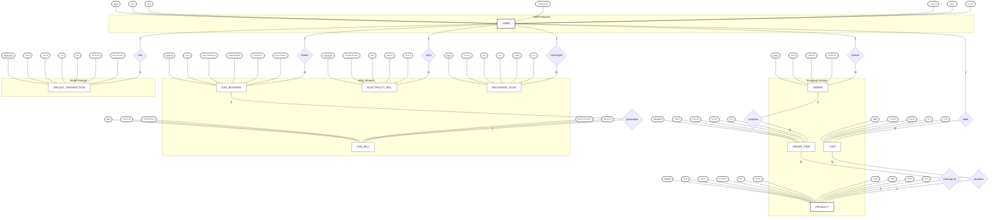

# MilkyWay ER Diagram

This diagram represents the **Unified Daily Utility & Shopping Ecosystem** using classical **Chen Notation**.

```mermaid
flowchart TD
    %% Entities (Rectangles)
    USER[USER]
    PRODUCT[PRODUCT]
    CART[CART]
    ORDER[ORDER]
    ORDER_ITEM[ORDER_ITEM]
    GAS_BOOKING[GAS_BOOKING]
    GAS_BILL[GAS_BILL]
    ELECTRICITY_BILL[ELECTRICITY_BILL]
    RECHARGE_PLAN[RECHARGE_PLAN]
    WALLET_TRANSACTION[WALLET_TRANSACTION]

    %% Relationships (Diamonds)
    places{places}
    contains_order{contains}
    belongs_to{belongs to}
    adds{adds}
    contains_cart{contains}
    books{books}
    generates{generates}
    pays{pays}
    recharges{recharges}
    has{has}

    %% USER Attributes (Ovals)
    U_id(["<u>userId</u>"]) --- USER
    U_name(["name"]) --- USER
    U_email(["email"]) --- USER
    U_mobile(["mobileNumber"]) --- USER
    U_pass(["password"]) --- USER
    U_addr(["address"]) --- USER
    U_pin(["pincode"]) --- USER

    %% PRODUCT Attributes
    P_id(["<u>productId</u>"]) --- PRODUCT
    P_name(["name"]) --- PRODUCT
    P_cat(["category"]) --- PRODUCT
    P_desc(["description"]) --- PRODUCT
    P_price(["price"]) --- PRODUCT
    P_qty(["quantity"]) --- PRODUCT
    P_weight(["weight"]) --- PRODUCT
    P_img(["image"]) --- PRODUCT
    P_daily(["isDaily"]) --- PRODUCT
    P_rating(["rating"]) --- PRODUCT

    %% CART Attributes
    C_id(["<u>cartId</u>"]) --- CART
    C_prodId(["productId"]) --- CART
    C_qty(["quantity"]) --- CART
    C_price(["price"]) --- CART
    C_userId(["userId"]) --- CART

    %% ORDER Attributes
    O_id(["<u>orderId</u>"]) --- ORDER
    O_userId(["userId"]) --- ORDER
    O_date(["orderDate"]) --- ORDER
    O_total(["totalAmount"]) --- ORDER

    %% ORDER_ITEM Attributes
    OI_id(["<u>orderItemId</u>"]) --- ORDER_ITEM
    OI_orderId(["orderId"]) --- ORDER_ITEM
    OI_productId(["productId"]) --- ORDER_ITEM
    OI_qty(["quantity"]) --- ORDER_ITEM
    OI_price(["price"]) --- ORDER_ITEM

    %% GAS_BOOKING Attributes
    GB_id(["<u>bookingId</u>"]) --- GAS_BOOKING
    GB_userId(["userId"]) --- GAS_BOOKING
    GB_prov(["gasProviderName"]) --- GAS_BOOKING
    GB_mob(["registeredMobile"]) --- GAS_BOOKING
    GB_price(["cylinderPrice"]) --- GAS_BOOKING
    GB_status(["paymentStatus"]) --- GAS_BOOKING

    %% GAS_BILL Attributes
    GBL_id(["<u>billId</u>"]) --- GAS_BILL
    GBL_custId(["customerId"]) --- GAS_BILL
    GBL_custName(["customerName"]) --- GAS_BILL
    GBL_prov(["gasProviderName"]) --- GAS_BILL
    GBL_amt(["billAmount"]) --- GAS_BILL

    %% ELECTRICITY_BILL Attributes
    EB_id(["<u>customerNo</u>"]) --- ELECTRICITY_BILL
    EB_prov(["electricityProvider"]) --- ELECTRICITY_BILL
    EB_state(["state"]) --- ELECTRICITY_BILL
    EB_due(["dueDate"]) --- ELECTRICITY_BILL
    EB_amt(["amount"]) --- ELECTRICITY_BILL

    %% RECHARGE_PLAN Attributes
    RP_id(["<u>planId</u>"]) --- RECHARGE_PLAN
    RP_comp(["company"]) --- RECHARGE_PLAN
    RP_data(["data"]) --- RECHARGE_PLAN
    RP_voice(["voice"]) --- RECHARGE_PLAN
    RP_val(["validity"]) --- RECHARGE_PLAN
    RP_price(["price"]) --- RECHARGE_PLAN

    %% WALLET_TRANSACTION Attributes
    WT_id(["<u>transactionId</u>"]) --- WALLET_TRANSACTION
    WT_userId(["userId"]) --- WALLET_TRANSACTION
    WT_amt(["amount"]) --- WALLET_TRANSACTION
    WT_type(["type"]) --- WALLET_TRANSACTION
    WT_date(["date"]) --- WALLET_TRANSACTION
    WT_refId(["referenceId"]) --- WALLET_TRANSACTION
    WT_refType(["referenceType"]) --- WALLET_TRANSACTION

    %% Connections with Diamonds
    USER ---|1| places ---|N| ORDER
    ORDER ---|1| contains_order ---|N| ORDER_ITEM
    ORDER_ITEM ---|N| belongs_to ---|1| PRODUCT
    USER ---|1| adds ---|N| CART
    CART ---|N| contains_cart ---|1| PRODUCT
    USER ---|1| books ---|N| GAS_BOOKING
    GAS_BOOKING ---|1| generates ---|1| GAS_BILL
    USER ---|1| pays ---|N| ELECTRICITY_BILL
    USER ---|1| recharges ---|N| RECHARGE_PLAN
    USER ---|1| has ---|N| WALLET_TRANSACTION

    %% Layout constraints
    %% Putting USER in the center conceptually
    subgraph center_group [USER Module]
        USER
    end
    
    subgraph left_group [Shopping Module]
        direction LR
        PRODUCT
        CART
        ORDER
        ORDER_ITEM
    end

    subgraph right_group [Utility Module]
        GAS_BOOKING
        GAS_BILL
        ELECTRICITY_BILL
        RECHARGE_PLAN
    end
    
    subgraph bottom_group [Wallet Module]
        WALLET_TRANSACTION
    end

    %% Minimal spacing styles
    style USER fill:#f9f9f9,stroke:#333,stroke-width:2px;
    style PRODUCT fill:#fff,stroke:#333,stroke-width:2px;
    style CART fill:#fff,stroke:#333,stroke-width:1px;
    style ORDER fill:#fff,stroke:#333,stroke-width:1px;
    style ORDER_ITEM fill:#fff,stroke:#333,stroke-width:1px;
    style GAS_BOOKING fill:#fff,stroke:#333,stroke-width:1px;
    style GAS_BILL fill:#fff,stroke:#333,stroke-width:1px;
    style ELECTRICITY_BILL fill:#fff,stroke:#333,stroke-width:1px;
    style RECHARGE_PLAN fill:#fff,stroke:#333,stroke-width:1px;
    style WALLET_TRANSACTION fill:#fff,stroke:#333,stroke-width:1px;
    
    %% Style attributes to be smaller
    classDef attr font-size:10px,fill:#fff,stroke:#333,color:#333;
    class U_id,U_name,U_email,U_mobile,U_pass,U_addr,U_pin attr;
    class P_id,P_name,P_cat,P_desc,P_price,P_qty,P_weight,P_img,P_daily,P_rating attr;
    class C_id,C_prodId,C_qty,C_price,C_userId attr;
    class O_id,O_userId,O_date,O_total attr;
    class OI_id,OI_orderId,OI_productId,OI_qty,OI_price attr;
    class GB_id,GB_userId,GB_prov,GB_mob,GB_price,GB_status attr;
    class GBL_id,GBL_custId,GBL_custName,GBL_prov,GBL_amt attr;
    class EB_id,EB_prov,EB_state,EB_due,EB_due,EB_amt attr;
    class RP_id,RP_comp,RP_data,RP_voice,RP_val,RP_price attr;
    class WT_id,WT_userId,WT_amt,WT_type,WT_date,WT_refId,WT_refType attr;
```
